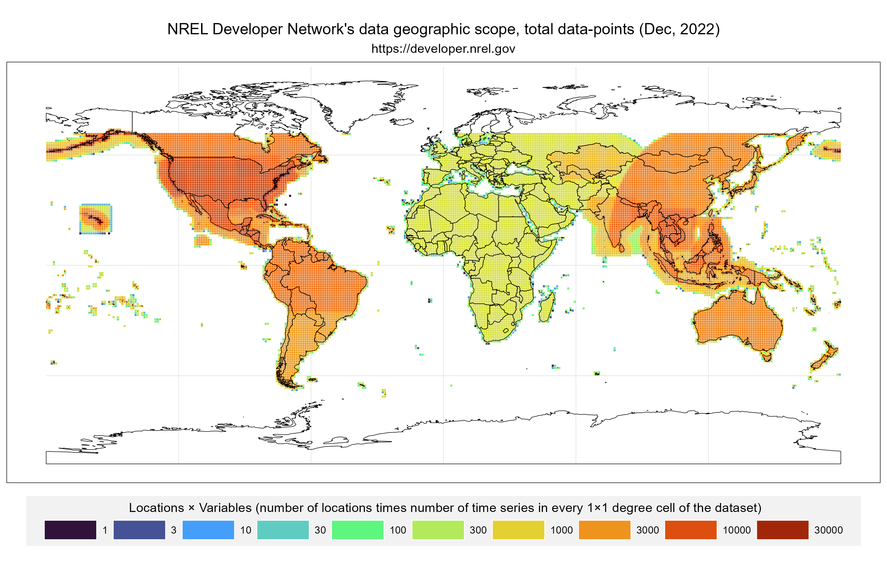

<!-- README.md is generated from README.Rmd. Please edit that file -->

```{r, include = FALSE}
knitr::opts_chunk$set(
  collapse = TRUE,
  comment = "#>",
  fig.path = "man/figures/",
  # fig.path = "man/figures/README-",
  out.width = "100%"
)
```

# nrel.dev.api

R package to access data from National Renewable Energy Lab (NREL) [developer network.](https://developer.nrel.gov/) <!-- badges: start -->

[](https://lifecycle.r-lib.org/articles/stages.html#experimental) [](https://CRAN.R-project.org/package=nrel.dev.api)

<!-- badges: end -->

<!-- ## Overview of NREL data-collections -->

<!-- {#id .class width=50% height=50%} -->

[](https://energyrt.github.io/nrel.dev.api/articles/datasets.html#data-availability-by-collections)

```{r fig_00_total.png, echo = FALSE}
# 
```


The goal of `nrel.dev.api` is to provide R-native access to NREL's renewable energy sources data-sets using the [NREL Developer Network API](https://developer.nrel.gov/).  

## Installation

You can install the development version of nrel.dev.api from [GitHub](https://github.com/energyRt) with:

``` r
# install.packages("devtools")
devtools::install_github("energyRt/nrel.dev.api")
```

## Example

Register at <https://developer.nrel.gov/> to get API key for your email address.

```{r example, eval=FALSE}
library(nrel.dev.api)

# to save your credentials (do once)
set_nrel_api_key(nrel.api.email = "YOUR_EMAIL", nrel.api.key = "YOUR_NREL_API_KEY")
# to retrieve
x <- get_nrel_api_email()
x
get_nrel_api_key(invisible = FALSE)
# get url address by the dataset name
get_nrel_url("india-wind") 
# fetch/download the data
x <- fetch_nrel_data(
  lon = 75.36621, lat = 24.72687,
  api_url = get_nrel_url("india-wind"),
  attributes = "windspeed_40m,windspeed_80m,windspeed_100m,windspeed_120m",
  interval = 15,
  names = "2014")
x

```


## References

1.  NREL developer network // <https://developer.nrel.gov/>
2.  Alternative API in Python // <https://pypi.org/project/nrel-dev-api/>
