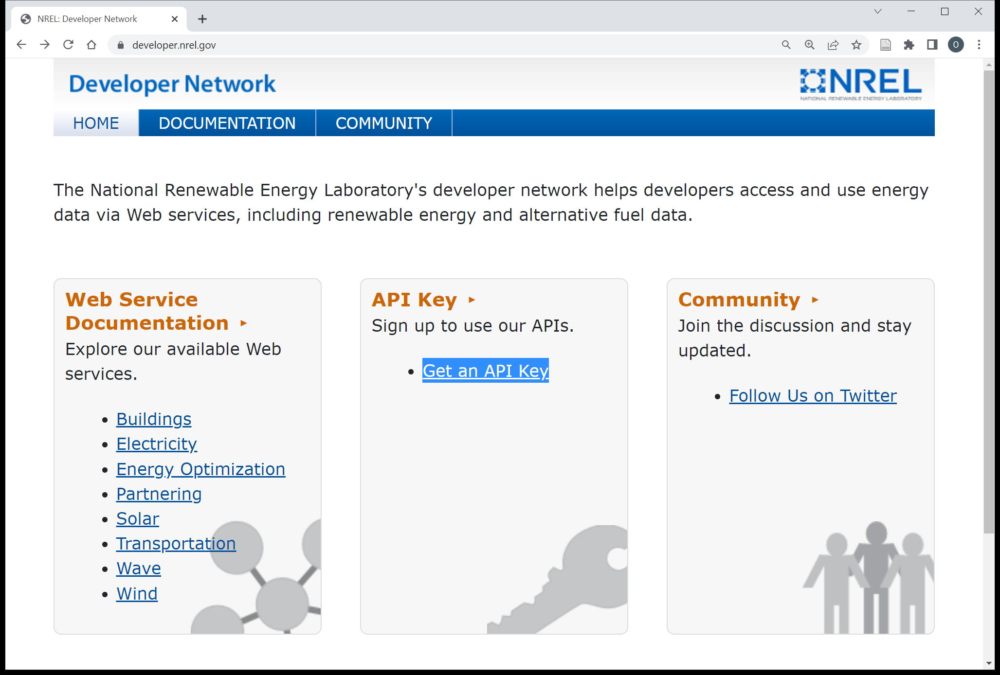

```{r, include = FALSE}
knitr::opts_chunk$set(
  collapse = TRUE,
  comment = "#>"
)
```

## Installation
```{r setup, eval=FALSE}
# install.packages("devtools") # if not installed
devtools::install_github("energyRt/nrel.dev.api")
```

## Registration
The first step is to register in the NREL's Network and request API credentials. After registration, the `key` will be sent to the provided email address. The email address and the `key` will be used as credentials to access NREL's data-sets.  

[](https://developer.nrel.gov/)  

## Storing credentials
The email address and the API key can be stored in the home folder of the system and will be loaded with the package next time. This procedure should be run once on every system unless the credentials changed.
```{r set_the_key, eval=FALSE}
library(nrel.dev.api)
set_nrel_api_key(nrel.api.email = "YOUR_EMAIL", 
                 nrel.api.key = "YOUR_NREL_API_KEY")
# retrieve the credentials
x <- get_nrel_api_email()
x
get_nrel_api_key(invisible = FALSE)
```

